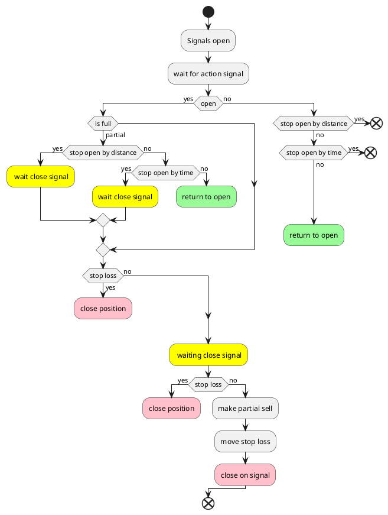
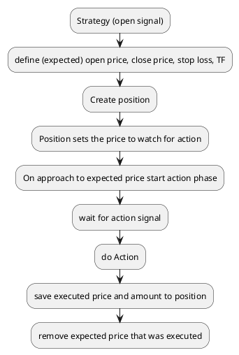
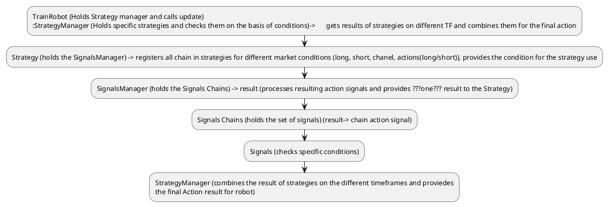

 # MVP definition
 
 ## Run commands
 List of additional params for that
 cRun test:
  for testing ```pytest``` is used
 
    docker compose up pybtctr2
 

  uncomment for single file test

    CMD [ "sh" ,"-c", "pytest -v test/position/test_position.py" ]

  -v  = "verbose" shows the functions names
  
  uncomment for full test run
    
    CMD [ "sh" ,"-c", "pytest" ] 
  
    

### Run debug:
Uncomment the debug section in docker file. 
The next config will run test.py from the root folder in container in debug mode.
To change test_file for debug use test.py 

### Run view

docker-compose -f docker-compose-view.yml up

docker-compose -f docker-compose-view.yml up --build

view_full_levels file contains cut version of view_full, with additional support of click callback for easier levels markdown.
this file selection can be changed in docker-compose-view.yml

### Run training:

docker-compose -f docker-compose.yml up --build


### Run class diagram creation
Creates class diagrma with related classes and inner method

	pyreverse -ASmy -k -o puml -d uml train_robot

Creates class relation diagram 

	pyreverse -o puml -d uml train_robot
### Other run commands
 
docker-compose up -f ...

docker run ...

docker run -p 8050:8050 -v /home/om/projects/

pybtctr2:/code -w /code pybtctr2

pyreverse -ASmy -k -o puml -d uml train_robot

pyreverse -o puml -d uml train_robot


#### data path

/var/lib/docker/volumes/pybtctr2_binance/_data/binance

#### docker volume creation
docker volume create --driver local --opt type=none --opt device=/home/om/projects/docker_vol --opt o=bind pybtctr_vol

docker run --rm -v pybtctr2_binance:/source -v pybtctr_vol:/destination busybox \
  sh -c "cp -av /source/* /destination/"

  docker run --rm -v pybtctr2_binance:/source -v pybtctr_vol:/destination --name temp_container alpine

#### NN data path + examples
cp -r best_model/ /var/lib/docker/volumes/pybtctr2_binance/_data/binance/2023_12_26_1W_link_usdt/shared/nn_data/


#### NN training execution and validation
sudo ./run_nn_train.sh

nvidia-smi

tensorboard --logdir=./logs/0001_all_tf_14


## VS code config files
Task.json:

		{
		"version": "2.0.0",
		"tasks": [
			{
				"type": "docker-build",
				"label": "docker-build",
				"platform": "python",
				"dockerBuild": {
					"tag": "pybtctr2:latest",
					"dockerfile": "${workspaceFolder}/Dockerfile",
					"context": "${workspaceFolder}",
					"pull": true
				},			
			},
			{
				"type": "docker-run",
				"label": "docker-run: debug",
				"dependsOn": [
					"docker-build"
				],
				"python": {
					//"file": "trainer.py",
					//"file": "test/train_robot_short/test_short_single.py",
					"file": "test.py",
					"args": ["simulate"]
				},
				"dockerRun": {
					"customOptions": "-v ${workspaceFolder}:/code -v pybtctr2_binance:/trader_data",			
				},
				"containerName": "pybtctr2",  
				"volumes": [
					{
							"localPath": "${workspaceFolder}",  // Mount workspace folder
							"containerPath": "/code"
					},
					{
							"localPath": "pybtctr2_binance",  // Mount pybtctr2_binance volume
							"containerPath": "/trader_data"
					}
			]
			}
		]
	}

launch.json:

	{
	"configurations": [
		{
			"name": "Docker: Python - General",
			"type": "docker",
			"request": "launch",
			"preLaunchTask": "docker-run: debug",
			"python": {
				"pathMappings": [
					{
						"localRoot": "${workspaceFolder}",
						"remoteRoot": "/code"
					}
				],
				"program": "/code/test/script.py",
				"projectType": "general",        
			},
			"env": {
				"DATA_ROOT": "binance",
				"DATA_SET_NAME" :"2022_08_01_1W",
				"DATA_START" : "1659551940000",
				"DATA_END" : "1660521600000",
				"PAIR" : "link_usdt",
				"AVAIABLE_THREADS" : "16",
			},			
		}
	]
	}


## AWS

Open an SSH client.

Locate your private key file. The key used to launch this instance is sing_first.pem

Run this command, if necessary, to ensure your key is not publicly viewable.
 chmod 400 "sing_first.pem"

Connect to your instance using its Public DNS:
 ec2-13-229-204-54.ap-southeast-1.compute.amazonaws.com

 Example:

 ssh -i "sing_first.pem" ubuntu@ec2-13-229-204-54.ap-southeast-1.compute.amazonaws.com

 

## Main flow:


## Q
Who is responsible for position action price -> strategy+market

who is responsible for position action amount -> expected price + stop_loss

## Amount
It's not profitable to have several takes, because whe we hit stop loss than we lose maximum and when we go profitable we can be loaded with only the part of desired position.
So it's better to concentrate on the better signals and stop-loss levels.

```TODO: concider position extension```

## Price flow
We use fixed price in the position when we decide to open. And we use this price to calculate position size and risks. After fixed price is approached, then we wait for signal to execute operation and at that point we get the flexible price that will go to executed position statistics.




### Price selection
How the price is selected???
Two variants: 
- the chain provides expected level for the price when defining the action if action is open then
	- pros: can set specific price expectations for each chain
	- cons: not all conditions can be valid for current price specification

- the strategy provides the price on the general market conditions: like if the signal chain has fired, then the strategy looks on the different strength levels (MA, BB, Levels, Predictions) and sets price near that level, then the position waits for action signal to fire to get the final price
	
	- pros: universal, the algorithm of the price expectations can be shared between different chains on the same market conditions
	- pros: easier to implement
	- pros: because of different strategies we can implement additional strategy to hanndle different price selections
	- cons: because of generality can lead to bigger amount of faluse prices

```Second variant is better to implement first because of it simplicity in comparison with the first one```

Who is responsible for price selection:
For price selection responsible - strategy.
Each Strategy will work in the specific conditions, that will allow to propose by hand expected price.
But the Strategy can have several signal chains that can lead to different price expectations
	
	Example:
	Like on rise market will work long strategy, the buy order will be possible to take on the different levels (like MA50, MA100,...) So the idea is that if the market is 


## Strategy flow





### Signals Chain

- responsible for the signals check 
- result - predefined action on fire
- holds different sets of signals and checks if all of them are fired to give specific action as a result

	Proposal is to add signals processor, that will check signals and give expected action for different timeframes
	on basis of this actions signals 

Responsible for Strategy signals and Action Signals
Strategy signals says what we expect of the marked and what/how open/close position
Action signals says the actual state of the market and provides the final action price to be initially executed


### Signals library
The simplest bricks that are used to to track state of the stock and predict potential changes

### Signals Manager

- holds the set of chains 
- responsible to combine the final signals from all chains for each TF

The set of signals that gives specific signal as result

### Strategy

- Holds Signal Manager 
- selects the final result action for all TF 
- provides the expected prices 
- sets the conditions that are used by the Strategy manager
- responsible for setting next action, for defining open, close and stop_loss prices

Uses data and position to get current state
Holds Signals manager to get actions from the data
Defines exppected behaviour on the comparison of different timeframe actions and states


#### Action/TF  selection
We have two classes: Strategy TF and action TF:
Action signal are 1 and 5 min. They can vary in terms of  market state:
	
- chanel (both slow and spikes near defined levels)
- in trend direction (mostly high sikes)
- against trend direction ( slow stop on the secondary levels, or spikes on the main levels)
	
The higher TF action has Higher priority (4H wins 1H, 1H wins 15m)
TF has trend_state and signal
Trend State can be: UNKNOWN, LONG, SHORT, CAN_LONG, CAN_SHORT, CHANEL  

- LONG, SHORT - defined by CCI, RSI with regards to MA position, and check in time for last X steps, and MA direction

TODO: potentialy price MA can be used as well

- CAN_X trend states are states that allow oposit position open by signal on the lower TF (open and stop loss level should be defined on higher TF, close level on lower TF) in raw trend implementation CAN_X should contain corrections

	Q?: how the trend change should be defined? Two possible options
	
	- ~~We try to get signal (like divergence) inside of trend calculation~~
	- We calculate LONG/SHORT trend and by getting OPEN signal change it state to CAN_X : result we don't change it, we conclude that, High tf signal allows to open on lower TF

- CHANEL - allowes open in both direction on the lower TF, defined by uncertain indicators (RSI~50, CCI~ 0), prefered direction can be chosen by higher TF trend state

- UNDEFINED - somehow not covered state, report warning and don't trade

#### How trend and signals should combine:
 - Trend should bee defined by CCI+RSI signals

 - The maximum tf that fires the signal for the position open should be used as the position TF (we should use lower tf for uncertain position)

- 15m should get confirmation from the higher TF
	
	- 240 should allow open (in trend, or signal)
	
	- 60 should allow open (in trend, or signal)
	
	- 15 should signal


- if no confirmation from one of higher TF then, stop should be bigger, close price on smaller tf

- can close part of the position on the local levels of the smaller tf and reopen later


If the opening in opposite direction with one of the higher tf then the higher stop loss (this should lead to smaller position or more  possible rejection) and lower close price should be used 

### Strategy Manager

- holds strategies for different market conditions
- responsible for checking this strategies (checks the strategy conditions) 
- providing result to robot
- gets the manual data and gives it to the strategy
- if two strategies have signals should decide which one to use

Uses data and position to get current state
Holds Signals manager to get actions from the data
Defines exppected behaviour on the comparison of different timeframe actions and states

```TODO: ```

### Actions Signals

```TODO: ```

# Strategies

1. There is trend defined by the CCI RSI indicators
2. There are corrections that could lead to trend change or change trend on the lower TF: corrections often lead to signals in othe rdirection
	- there are a set of signals that can be used to spot corrections:
		 - RSI BIG distance > 10
		 - CCI extra big value > 140
		 - 

3. There are extreme levels two high CCI RSI that signifise strong trend -> should be checked with higher TF

Strategies should be as much simple as possible: more then 5 conditions should lead to super specific cases

Higher TF should allow LONG, SHORT or CHANEL trading


## Price levels definition 
### 1.Hand levels implementation
- horizontal
- slope
### 2. Auto horizontal levels implementation
- on the points of previous stops
### 3. Moving levels (MA, BB)
 if trend is UP 	
	
	cur open > BBUM	-> BBUM, BBU
	
	cur open < BBUM & cur open >BBM	-> BBM, BBU
	
	cur open  < BBM - > BBD, BBM

	if MA > cur price open && MA dist < 2*ATR -> set higher level max(BB, MA)

if trend DOWN:
	
	cur open < BBDM	-> BBDM, BBD
	
	cur open > BBDM & cur open <BBM	-> BBD, BBM
	
	cur open > BBM -> BBM, BBD

	if MA < cur price open && MA dist < 2*ATR -> set lower level min(BB, MA)  

if trend is CHANEL
	
	cur open < BBM-> BBD, BBM
	cur open > BBM-> BBM, BBU
 

Q: how to use ATR
Q: how to use volume (at least spikes)

## Implementing actions
 1. if action fired signal ->strat
 2. if price near the level -> for short near top, for  long near bot -> strat
 3. set open price near the level -> strat
 4. set stop loss price near the level (can be 60 level) get 15 min atr if there are another level inside, switch, continue untill no new level found -> strat
 5. set close price to the 15 target, if 60 in same direction, set 60 as target, if 240 is in same direction set as target -> start
 6. Enable action state for position -> strat+pos ->  missing: action state for position (review position)-> replace with history signal from the strategy, during this history wait for the action signal
 missing: fixed history for signals

 7. if price reaches 0.8 sell safety -> done (just set 0.8 price)
 8. if price reaches target, -> sell (later refactor for moving stop loss in certain cases)
 9. enable partial sell
 10. move stop loss -> sar 15
 11. If 60 tf sell signal -> sar 5 
 12. if 240 tf sell signal -> sar 1
